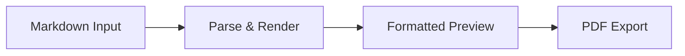

# Project Overview

## Problem Statement

Many people write in Markdown because it is fast and portable, but they still need a normal, formatted document view and a PDF for sharing or printing. Existing tools are often too complex, require accounts, or do not produce clean PDF output. Markora PDF aims to fill that gap with a simple, browser-based workflow: write Markdown, see the formatted result immediately, and export to PDF.

## Target Users

- **Students** — Notes, assignments, and study guides
- **Writers and bloggers** — Drafts and articles before final publishing
- **Professionals** — Quick reports, memos, and documentation
- **Beginners** — Anyone learning Markdown who wants an easy preview and export path

## Core Workflow

1. User opens Markora PDF in a web browser
2. User types or pastes Markdown into the editor
3. The app shows a live formatted preview (normal document view)
4. User clicks **Export to PDF** to download a PDF of the preview
5. (Future) User may choose a template or save the document

## MVP Scope

- Static web UI with editor and preview panes
- Client-side Markdown parsing and HTML rendering
- Basic styling for readable document preview
- PDF export from the preview (client-side library)
- Placeholder folders for templates and export storage
- Documentation and testing checklists

## Out-of-Scope Items for MVP

- User login and authentication
- Server-side document storage
- Template system (Phase 4)
- Hindi/Sanskrit font handling beyond basic Unicode (dedicated testing in later phases)
- Collaborative editing
- Cloud sync or sharing links
- Payment or subscription features
- Mobile native apps
- Advanced PDF features (headers, footers, page numbers, watermarks)
