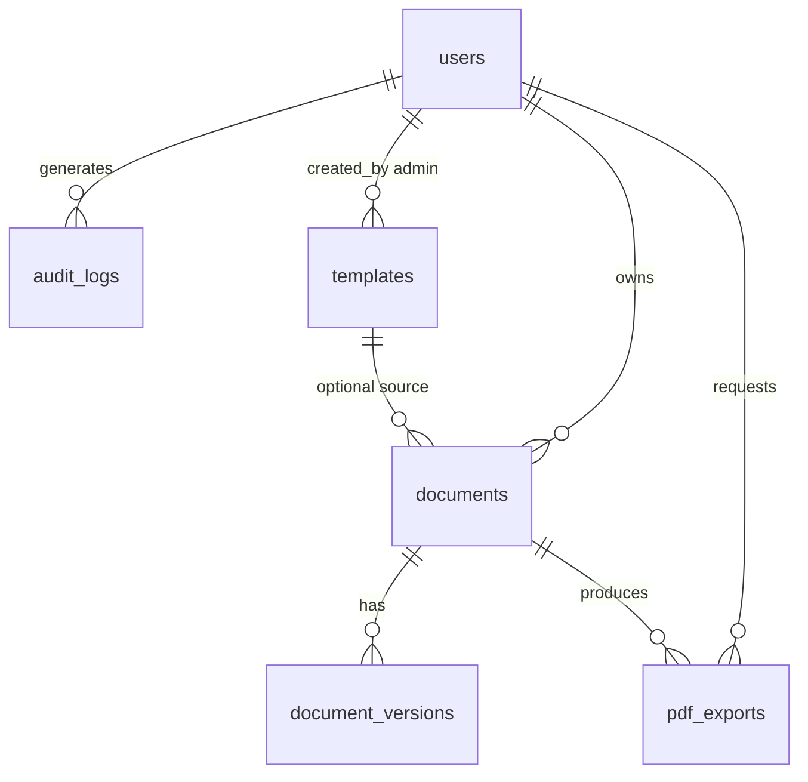

# Database Schema Plan (Phase 6 — Planning Only)

> **Status:** Planning document only. No database, migrations, or tables exist yet.

This document plans the relational schema for Markora PDF when a backend is implemented. SQL dialect examples use portable types; adjust for MySQL vs PostgreSQL during implementation.

---

## Design principles

1. **UUID primary keys** for `users`, `documents`, and related entities (avoid sequential ID guessing)
2. **Soft delete** for documents (`deleted_at`) so users can recover mistakes
3. **Version immutability** — `document_versions` rows are append-only
4. **Owner isolation** — every document row has `user_id`; all queries filter by authenticated user
5. **Separate content from metadata** — large Markdown bodies in `documents` / versions; PDF binaries in filesystem or object storage with path in `pdf_exports`
6. **Audit everything sensitive** — login, export, delete → `audit_logs`

---

## Entity relationship overview



---

## Table: `users`

Stores account information. No plain-text passwords.

| Column | Type | Constraints | Notes |
|--------|------|-------------|-------|
| `id` | CHAR(36) | PK | UUID v4 |
| `email` | VARCHAR(255) | UNIQUE, NOT NULL | Login identifier |
| `password_hash` | VARCHAR(255) | NOT NULL | bcrypt or argon2 |
| `display_name` | VARCHAR(100) | NULL | Optional friendly name |
| `role` | ENUM('user','admin') | DEFAULT 'user' | Admin manages templates |
| `email_verified_at` | TIMESTAMP | NULL | Future email verification |
| `created_at` | TIMESTAMP | NOT NULL | |
| `updated_at` | TIMESTAMP | NOT NULL | |
| `last_login_at` | TIMESTAMP | NULL | |
| `is_active` | BOOLEAN | DEFAULT true | Disable without delete |

**Indexes:** `UNIQUE(email)`, `INDEX(role)`

---

## Table: `documents`

A saved Markdown document owned by one user.

| Column | Type | Constraints | Notes |
|--------|------|-------------|-------|
| `id` | CHAR(36) | PK | UUID |
| `user_id` | CHAR(36) | FK → users.id, NOT NULL | Owner |
| `title` | VARCHAR(255) | NOT NULL | Derived or user-set |
| `slug` | VARCHAR(255) | NULL | URL-friendly optional |
| `markdown_content` | MEDIUMTEXT / TEXT | NOT NULL | Current body |
| `template_id` | CHAR(36) | FK → templates.id, NULL | If created from template |
| `current_version` | INT | DEFAULT 1 | Matches latest version row |
| `word_count` | INT | DEFAULT 0 | Cached stats |
| `char_count` | INT | DEFAULT 0 | Cached stats |
| `created_at` | TIMESTAMP | NOT NULL | |
| `updated_at` | TIMESTAMP | NOT NULL | |
| `deleted_at` | TIMESTAMP | NULL | Soft delete |

**Indexes:** `INDEX(user_id, updated_at DESC)`, `INDEX(user_id, deleted_at)`, `UNIQUE(user_id, slug)` (where slug not null)

---

## Table: `document_versions`

Immutable snapshots when user saves or auto-saves.

| Column | Type | Constraints | Notes |
|--------|------|-------------|-------|
| `id` | CHAR(36) | PK | UUID |
| `document_id` | CHAR(36) | FK → documents.id, NOT NULL | |
| `user_id` | CHAR(36) | FK → users.id, NOT NULL | Denormalized for audit queries |
| `version_number` | INT | NOT NULL | 1, 2, 3… per document |
| `markdown_content` | MEDIUMTEXT / TEXT | NOT NULL | Snapshot at save time |
| `change_summary` | VARCHAR(255) | NULL | Optional user note |
| `word_count` | INT | DEFAULT 0 | |
| `created_at` | TIMESTAMP | NOT NULL | |

**Indexes:** `UNIQUE(document_id, version_number)`, `INDEX(document_id, created_at DESC)`

**Rule:** Never UPDATE or DELETE version rows in normal operation; retention policy may archive old versions later.

---

## Table: `pdf_exports`

Metadata for each PDF generation request (client or server).

| Column | Type | Constraints | Notes |
|--------|------|-------------|-------|
| `id` | CHAR(36) | PK | UUID |
| `user_id` | CHAR(36) | FK → users.id, NOT NULL | |
| `document_id` | CHAR(36) | FK → documents.id, NULL | Null if one-off export |
| `filename` | VARCHAR(255) | NOT NULL | e.g. `invoice.pdf` |
| `storage_path` | VARCHAR(512) | NULL | Relative path under `storage/exports/` |
| `file_size_bytes` | BIGINT | NULL | |
| `export_method` | ENUM('client','server') | NOT NULL | html2pdf vs microservice |
| `status` | ENUM('pending','completed','failed') | DEFAULT 'pending' | |
| `error_message` | TEXT | NULL | If failed |
| `created_at` | TIMESTAMP | NOT NULL | |
| `completed_at` | TIMESTAMP | NULL | |

**Indexes:** `INDEX(user_id, created_at DESC)`, `INDEX(document_id)`, `INDEX(status)`

**Note:** Binary PDF files live on disk or S3-compatible storage; DB stores metadata only.

---

## Table: `templates`

Server-managed templates (extends MVP static templates).

| Column | Type | Constraints | Notes |
|--------|------|-------------|-------|
| `id` | CHAR(36) | PK | UUID |
| `slug` | VARCHAR(100) | UNIQUE, NOT NULL | e.g. `invoice` |
| `name` | VARCHAR(150) | NOT NULL | Display name |
| `description` | TEXT | NULL | |
| `markdown_content` | MEDIUMTEXT / TEXT | NOT NULL | Template body |
| `category` | VARCHAR(50) | NULL | legal, business, dev, etc. |
| `is_active` | BOOLEAN | DEFAULT true | Hide without delete |
| `sort_order` | INT | DEFAULT 0 | Dropdown ordering |
| `created_by` | CHAR(36) | FK → users.id, NULL | Admin user |
| `created_at` | TIMESTAMP | NOT NULL | |
| `updated_at` | TIMESTAMP | NOT NULL | |

**Indexes:** `UNIQUE(slug)`, `INDEX(is_active, sort_order)`

**Migration from MVP:** Seed rows from `templates/*.md` and `templates.js` on first deploy.

---

## Table: `audit_logs`

Security and compliance trail.

| Column | Type | Constraints | Notes |
|--------|------|-------------|-------|
| `id` | BIGINT | PK AUTO_INCREMENT / BIGSERIAL | Sequential OK for logs |
| `user_id` | CHAR(36) | FK → users.id, NULL | Null for failed login attempts |
| `action` | VARCHAR(50) | NOT NULL | e.g. `document.create` |
| `resource_type` | VARCHAR(50) | NULL | `document`, `pdf_export`, `session` |
| `resource_id` | CHAR(36) | NULL | Target entity UUID |
| `ip_address` | VARCHAR(45) | NULL | IPv4 or IPv6 |
| `user_agent` | VARCHAR(512) | NULL | Truncated |
| `metadata` | JSON | NULL | Extra context (no secrets) |
| `created_at` | TIMESTAMP | NOT NULL | |

**Indexes:** `INDEX(user_id, created_at DESC)`, `INDEX(action, created_at DESC)`, `INDEX(resource_type, resource_id)`

**Example actions:** `auth.login`, `auth.logout`, `auth.login_failed`, `document.create`, `document.update`, `document.delete`, `pdf.export`, `template.list`

---

## Supporting tables (optional, later)

| Table | Purpose |
|-------|---------|
| `password_reset_tokens` | Forgot-password flow (see `10_AUTH_SECURITY_PLAN.md`) |
| `sessions` | Server-side session store if not using JWT-only |
| `api_keys` | Service-to-service (PHP → Node PDF) |

Not required for MVP backend v1; plan when implementing auth.

---

## Storage layout (filesystem)

Aligns with existing project folders:

```
storage/
├── exports/          # Completed PDF files (pdf_exports.storage_path)
├── temp/             # In-progress PDF generation
└── uploads/          # Future: user attachments (not in MVP backend v1)
```

---

## Sample queries (future)

**List user's documents (non-deleted):**

```sql
SELECT id, title, word_count, updated_at
FROM documents
WHERE user_id = :user_id AND deleted_at IS NULL
ORDER BY updated_at DESC
LIMIT 50;
```

**Save new version on update:**

```sql
-- 1. Insert document_versions row with version_number = current_version + 1
-- 2. UPDATE documents SET markdown_content = :body, current_version = current_version + 1
```

---

## PostgreSQL vs MySQL notes

| Feature | PostgreSQL | MySQL |
|---------|------------|-------|
| JSON metadata in audit_logs | Native JSONB | JSON type |
| Full-text search on documents | `tsvector` | `FULLTEXT` index |
| UUID generation | `gen_random_uuid()` | `UUID()` function |

---

## Related documents

- `08_BACKEND_PLAN.md` — stack choice
- `10_AUTH_SECURITY_PLAN.md` — user access
- `11_API_ENDPOINT_PLAN.md` — how tables are used via API

---

*Phase 6 planning only. No database has been created.*
