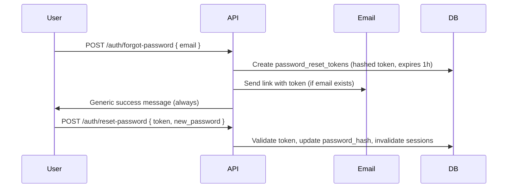

# Authentication & Security Plan (Phase 6 — Planning Only)

> **Status:** Planning document only. No login, sessions, or auth code exists in the application yet.

This document defines how Aquila DocForge should handle authentication and security when a backend is added. It extends `02_SECURITY_NOTES.md` (MVP client-side concerns) with server-side requirements.

---

## Security goals

1. Only authenticated users access their own documents
2. Passwords are never stored or logged in plain text
3. Sessions resist hijacking, fixation, and CSRF
4. All state-changing API calls require valid auth + CSRF token
5. Sensitive actions are audit-logged
6. Fail securely — generic errors on login; no user enumeration leaks

---

## Password hashing

### Algorithm

| Priority | Algorithm | Notes |
|----------|-----------|-------|
| **Preferred** | **Argon2id** | Modern memory-hard hashing (PHP `password_hash` PASSWORD_ARGON2ID; Node `argon2` package) |
| **Acceptable** | **bcrypt** | Cost factor ≥ 12; widely supported |

### Rules

- Never store `password`, `password_confirmation`, or hashes in `audit_logs`
- Hash on server only — never send plain password to client storage
- Re-hash on login if algorithm parameters are upgraded (bcrypt/argon2 support this)
- Minimum password policy (v1): 8+ characters; consider zxcvbn strength meter in UI later
- Reject common passwords (optional: HIBP k-anonymity API)

### Database

Store only in `users.password_hash` (see `09_DATABASE_SCHEMA_PLAN.md`).

---

## Sessions

### Recommended model: server-side sessions

| Component | Plan |
|-----------|------|
| Session ID | Cryptographically random, 128+ bits; stored in cookie |
| Session store | Database `sessions` table or Redis for production |
| Lifetime | 24 hours idle timeout; 30 days absolute max (configurable) |
| Rotation | Regenerate session ID on login and privilege change |
| Invalidation | Logout deletes server session; password change invalidates all sessions |

### Session cookie settings

```
Set-Cookie: docforge_session=<id>;
  HttpOnly;
  Secure;          // HTTPS only in production
  SameSite=Lax;    // or Strict for higher security
  Path=/;
  Max-Age=86400
```

| Flag | Purpose |
|------|---------|
| `HttpOnly` | JavaScript cannot read cookie (XSS mitigation) |
| `Secure` | Sent only over HTTPS |
| `SameSite=Lax` | Reduces CSRF on cross-site requests |

### Alternative: JWT in memory + refresh cookie

Consider for SPA-heavy future; for MVP backend v1, **server-side sessions + cookie** are simpler and easier to revoke.

---

## CSRF protection

### Threat

Authenticated user visits malicious site that POSTs to DocForge API (e.g. delete document).

### Mitigation

| Method | Implementation |
|--------|----------------|
| **Synchronizer token** | Server sets CSRF token in session; frontend sends `X-CSRF-Token` header on POST/PUT/PATCH/DELETE |
| **SameSite cookies** | `Lax` or `Strict` on session cookie |
| **Origin check** | Reject requests where `Origin` / `Referer` does not match allowed host |

### API rule

All state-changing endpoints (`POST`, `PUT`, `PATCH`, `DELETE`) require:

1. Valid session
2. Valid CSRF token (except pure JSON API with Bearer token from same-origin SPA — still use CSRF for cookie-based auth)

Safe methods (`GET`, `HEAD`) do not require CSRF token but still require auth where appropriate.

---

## Access control

### Model: role-based + resource ownership

| Role | Permissions |
|------|-------------|
| `user` | CRUD own documents; export own PDFs; list active templates |
| `admin` | Above + manage templates; view aggregate audit logs |

### Document access rules

Every `documents`, `document_versions`, and `pdf_exports` query MUST include:

```text
WHERE user_id = :authenticated_user_id
```

Never trust `user_id` from client JSON — always use session.

### IDOR prevention

- Use UUIDs in URLs (`/api/documents/{uuid}`)
- Return **404** (not 403) when document exists but belongs to another user — avoids leaking existence
- Validate `template_id` references active templates only

### Rate limiting (planned)

| Endpoint | Limit |
|----------|-------|
| `POST /auth/login` | 5 attempts / 15 min per IP + email |
| `POST /auth/forgot-password` | 3 / hour per email |
| `POST /api/documents` | 60 / hour per user |
| `POST /api/pdf/export` | 20 / hour per user |

---

## Secure cookies (summary)

| Cookie | HttpOnly | Secure | SameSite | Purpose |
|--------|----------|--------|----------|---------|
| `docforge_session` | Yes | Yes (prod) | Lax | Session ID |
| `docforge_csrf` | No* | Yes | Strict | CSRF double-submit optional |

\* CSRF token may be exposed to JS via meta tag or dedicated endpoint instead of a readable cookie.

---

## Forgot password (future plan)

**Not implemented in MVP or Phase 6 planning code.** Planned flow:



### Security requirements

- Token: single-use, random 32+ bytes, stored hashed in DB
- Expiry: 1 hour default
- Same response whether email exists (prevent enumeration)
- Invalidate all sessions on successful reset
- Audit log: `auth.password_reset_requested`, `auth.password_reset_completed`
- Rate limit requests per IP and email

### Table: `password_reset_tokens` (future)

| Column | Type |
|--------|------|
| `id` | UUID |
| `user_id` | FK users |
| `token_hash` | VARCHAR(255) |
| `expires_at` | TIMESTAMP |
| `used_at` | TIMESTAMP NULL |

---

## Transport and headers

Production deployment MUST use **HTTPS**.

Recommended response headers:

| Header | Value |
|--------|-------|
| `Strict-Transport-Security` | `max-age=31536000; includeSubDomains` |
| `X-Content-Type-Options` | `nosniff` |
| `X-Frame-Options` | `DENY` or `SAMEORIGIN` |
| `Content-Security-Policy` | Restrict scripts to self + known CDNs |
| `Referrer-Policy` | `strict-origin-when-cross-origin` |

---

## Input validation

| Input | Validation |
|-------|------------|
| Email | Format + max length 255 |
| Markdown body | Max size (e.g. 2 MB); sanitize on render (keep `html: false`) |
| Title | Max 255 chars; strip control characters |
| Filename (PDF) | Allowlist alphanumeric, dash, underscore |

---

## Audit logging

Log to `audit_logs` (see schema plan):

- Successful and failed logins
- Logout
- Document create / update / delete
- PDF export request
- Password reset request / completion
- Admin template changes

Never log: passwords, session tokens, full document bodies in metadata.

---

## MVP → backend migration security

1. Existing client-only users have no accounts — first visit creates account or continues local-only mode (optional feature flag)
2. No secrets in `public/assets/js/` — API keys server-side only
3. PHP → Node PDF calls use internal API key on private network, not exposed to browser

---

## Related documents

| Document | Topic |
|----------|-------|
| `02_SECURITY_NOTES.md` | Client XSS, Markdown safety |
| `09_DATABASE_SCHEMA_PLAN.md` | `users`, `audit_logs` |
| `11_API_ENDPOINT_PLAN.md` | Auth endpoints |
| `08_BACKEND_PLAN.md` | Stack choice |

---

*Phase 6 planning only. No authentication has been implemented.*
