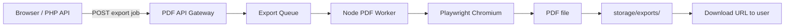

# Professional PDF Engine Plan (Phase 7 — Planning Only)

> **Status:** Planning document only. No PDF microservice, Node server, or Playwright code has been implemented.

This document plans how Aquila DocForge will move from **client-side html2pdf.js** (raster, limited layout control) to a **professional server-side PDF pipeline** using Node.js and Playwright.

---

## Why a separate PDF engine?

| Limitation (MVP / html2pdf.js) | Professional engine goal |
|--------------------------------|--------------------------|
| Screenshot-based output | True vector text where possible |
| Weak page breaks | Reliable pagination |
| No running headers/footers | Branded headers, footers, page numbers |
| No watermarks | Draft / confidential watermarks |
| Large docs strain the browser | Server handles heavy jobs via queue |
| Font/script inconsistencies | Controlled server fonts (incl. Devanagari) |

The browser **Export PDF** button remains as fallback. Server export is optional when user is logged in and backend is available (see `11_API_ENDPOINT_PLAN.md`).

---

## Architecture overview



| Component | Role |
|-----------|------|
| **PHP or Node main API** | Auth, validate request, enqueue job, store metadata in `pdf_exports` |
| **Node PDF microservice** | Render HTML → PDF via Playwright |
| **Queue** | Async jobs for long documents (see `14_PDF_EXPORT_QUEUE_PLAN.md`) |
| **Object storage / filesystem** | `storage/exports/` for completed PDFs |

---

## Node.js microservice

### Why Node.js

- Same runtime family as async workers and JSON APIs (see `08_BACKEND_PLAN.md`)
- Strong ecosystem for Playwright and job queues (BullMQ, etc.)
- Isolated service — PDF crashes do not take down main app
- Horizontal scaling: add more worker processes

### Planned service layout (future — not created)

```
pdf-service/                    # future folder
├── src/
│   ├── server.js               # Health + internal API
│   ├── worker.js               # Queue consumer
│   ├── render/
│   │   ├── playwright.js       # Browser launch & PDF
│   │   └── html-builder.js     # Wrap content in print template
│   └── themes/                 # CSS per theme (see doc 13)
├── package.json
└── .env.example
```

### Internal API (service-to-service only)

Not exposed to the public internet without authentication.

```http
POST /internal/render
Authorization: Bearer <service-api-key>

{
  "html": "<full document HTML>",
  "options": {
    "format": "A4",
    "theme": "business",
    "header": { "title": "Invoice", "logo_url": null },
    "footer": { "show_page_numbers": true },
    "watermark": { "text": "DRAFT", "opacity": 0.15 }
  }
}
```

**Response:** PDF binary stream or path to written file.

---

## Playwright

### Why Playwright (vs Puppeteer alone)

- Maintained by Microsoft; reliable headless Chromium
- Consistent `page.pdf()` API with margin, format, header/footer templates
- Good font rendering when fonts are bundled or installed on server
- Active cross-browser support if Firefox PDF is ever needed

### Rendering pipeline (planned)

1. Receive sanitized HTML body (from Markdown already converted server-side or sent as HTML snapshot)
2. Wrap in **print shell** — theme CSS, `@page` rules, header/footer slots
3. Launch headless Chromium (reuse browser instance per worker)
4. `page.setContent(html, { waitUntil: 'networkidle' })`
5. `page.pdf({ format: 'A4', printBackground: true, displayHeaderFooter: true, ... })`
6. Write to `storage/exports/{export_id}.pdf`
7. Update `pdf_exports.status` → `completed`

### Security

- **Never** pass raw user HTML with scripts enabled — sanitize like MVP (`html: false` equivalent server-side)
- Run Chromium with `--no-sandbox` only in controlled containers
- No arbitrary URL navigation — `setContent` only, or allowlisted `file://` / internal preview URLs
- Service API key rotation; private network between main API and PDF service

---

## Server-side HTML to PDF

### Input sources

| Source | When |
|--------|------|
| **HTML snapshot** | Frontend sends rendered preview HTML after Markdown conversion |
| **Server render** | API converts stored Markdown with same rules as markdown-it |
| **Template + data** | Future: merge theme with document metadata |

### HTML document structure (planned)

```html
<!DOCTYPE html>
<html lang="en">
<head>
  <meta charset="UTF-8">
  <link rel="stylesheet" href="/themes/business.css">
</head>
<body class="pdf-theme-business">
  <article class="pdf-body">
    <!-- sanitized user content -->
  </article>
</body>
</html>
```

Playwright injects **header** and **footer** via `displayHeaderFooter` + `headerTemplate` / `footerTemplate` (Chromium print API).

---

## A4 page setup

### Default print options (planned)

| Setting | Value |
|---------|-------|
| Format | `A4` (210 × 297 mm) |
| Orientation | `portrait` (default); `landscape` optional per request |
| Margins | top 20 mm, right 15 mm, bottom 25 mm, left 15 mm (footer space) |
| `printBackground` | `true` (preserve blockquote/code backgrounds) |
| `preferCSSPageSize` | `true` (respect `@page` in theme CSS) |

### CSS `@page` (in theme files)

```css
@page {
  size: A4 portrait;
  margin: 20mm 15mm 25mm 15mm;
}
```

See `13_PDF_TEMPLATE_STYLE_GUIDE.md` for per-theme adjustments.

---

## Headers

### Planned header content

| Field | Example |
|-------|---------|
| Document title | Project Report — Q2 2026 |
| Organization name | Acme Corp |
| Logo | Optional image URL (HTTPS, allowlisted) |
| Date | Generated date (server timezone UTC) |

### Implementation approach

Use Playwright/Chromium **header template** HTML (small inline-styled fragment):

```html
<div style="font-size:9px; width:100%; padding:0 15mm;">
  <span>Acme Corp</span>
  <span style="float:right">Project Report</span>
</div>
```

Theme **Legal** may use centered case number; **Academic** may use university name.

---

## Footers

### Planned footer content

| Element | Default |
|---------|---------|
| Page numbers | "Page 1 of 12" |
| Confidentiality line | Optional per theme |
| Document ID / export ID | Optional for audit |

### Implementation

```html
<div style="font-size:8px; width:100%; padding:0 15mm;">
  <span>Confidential</span>
  <span style="float:right">Page <span class="pageNumber"></span> of <span class="totalPages"></span></span>
</div>
```

Chromium replaces `pageNumber` and `totalPages` automatically in header/footer templates.

---

## Page numbers

| Requirement | Plan |
|-------------|------|
| Position | Footer right (configurable per theme) |
| Format | `Page N of M` |
| Skip first page | Optional for cover-style documents (future) |
| Start at 1 | Default; offset configurable later |

---

## Watermarks

### Use cases

| Watermark | When |
|-----------|------|
| `DRAFT` | Unpublished documents |
| `CONFIDENTIAL` | Legal / business themes |
| `COPY` | Internal distribution |
| Custom text | Per export request |

### Implementation options (planned)

1. **CSS fixed position** — `::before` on `body` with rotated text, low opacity (works inside content area)
2. **Chromium overlay** — repeat text via background image generated server-side
3. **PDF post-process** — future; not v1

### Default styling

```css
body.pdf-watermark-draft::before {
  content: "DRAFT";
  position: fixed;
  top: 50%;
  left: 50%;
  transform: translate(-50%, -50%) rotate(-45deg);
  font-size: 72px;
  opacity: 0.12;
  color: #888;
  pointer-events: none;
  z-index: 9999;
}
```

Request flag: `{ "watermark": { "text": "DRAFT", "enabled": true } }`

---

## Comparison: MVP vs professional engine

| Feature | html2pdf.js (now) | Playwright (planned) |
|---------|-------------------|----------------------|
| Text quality | Raster | Vector (selectable text) |
| Page size | A4 via jsPDF | Native A4 |
| Headers/footers | No | Yes |
| Page numbers | No | Yes |
| Watermarks | No | Yes |
| Server required | No | Yes |
| Privacy | 100% local | HTML sent to server (HTTPS) |

---

## Dependencies (future install — not done now)

| Package | Purpose |
|---------|---------|
| `playwright` | Headless browser PDF |
| `express` or `fastify` | Internal HTTP API |
| `bullmq` + Redis | Job queue (see doc 14) |
| `dompurify` + `jsdom` | Server HTML sanitization |

**Do not install until implementation phase begins.**

---

## Rollout phases (future)

| Step | Deliverable |
|------|-------------|
| 7a | Playwright proof-of-concept: HTML file → PDF on disk |
| 7b | Theme CSS (doc 13) integrated |
| 7c | Internal API + service auth |
| 7d | Queue worker (doc 14) |
| 7e | Main API `POST /pdf/export` integration |
| 7f | Frontend "Server PDF" option when logged in |

---

## Related documents

| Document | Topic |
|----------|-------|
| `13_PDF_TEMPLATE_STYLE_GUIDE.md` | Theme definitions |
| `14_PDF_EXPORT_QUEUE_PLAN.md` | Job states and retry |
| `11_API_ENDPOINT_PLAN.md` | Public export API |
| `09_DATABASE_SCHEMA_PLAN.md` | `pdf_exports` table |
| `07_KNOWN_LIMITATIONS.md` | Current browser PDF limits |

---

*Phase 7 planning only. No PDF microservice has been built.*
