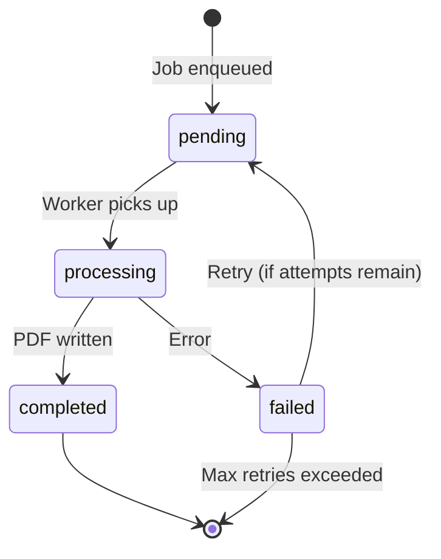
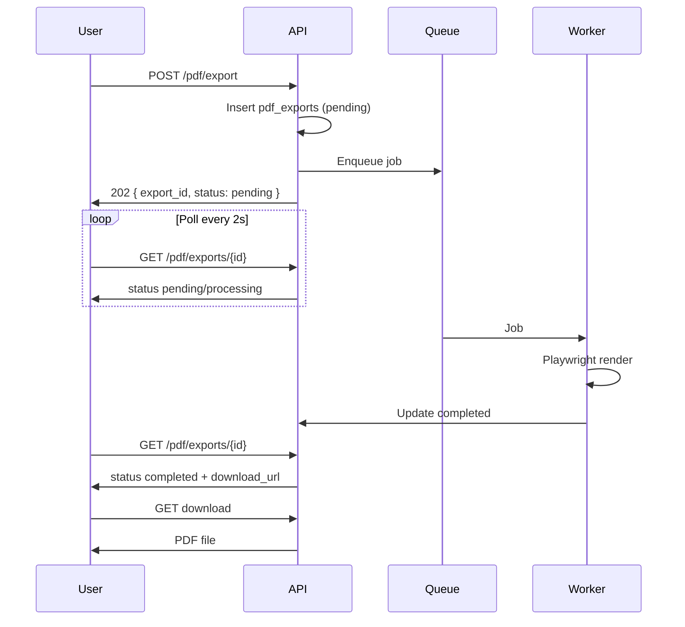

# PDF Export Queue Plan (Phase 7 — Planning Only)

> **Status:** Planning document only. No queue, Redis, or worker processes exist yet.

This document plans the **asynchronous job queue** for professional PDF generation. Large or complex documents should not block the HTTP request thread; users poll or receive notification when PDF is ready.

Aligns with `pdf_exports` table in `09_DATABASE_SCHEMA_PLAN.md` and `POST /api/v1/pdf/export` in `11_API_ENDPOINT_PLAN.md`.

---

## Why a queue?

| Problem | Queue solution |
|---------|----------------|
| Playwright PDF takes 2–30+ seconds | API returns immediately with `export_id` |
| Multiple concurrent exports overload server | Workers process jobs at controlled concurrency |
| Transient Chromium crashes | Retry failed jobs |
| User closes browser | PDF still generated; download later |
| Audit and billing | Every job tracked with status timestamps |

---

## Architecture



```text
┌──────────────┐    enqueue     ┌─────────────┐    consume    ┌────────────────┐
│ Main API     │ ─────────────► │ Redis Queue │ ────────────► │ PDF Worker(s)  │
│ (PHP/Node)   │                │ (BullMQ)    │               │ Playwright     │
└──────────────┘                └─────────────┘               └────────────────┘
       │                               │                              │
       │         update status         │                              │
       └───────────────────────────────┴──────────────────────────────┘
                         pdf_exports table + storage/exports/
```

---

## Job states

### `pending`

| Aspect | Detail |
|--------|--------|
| Meaning | Job accepted, waiting for worker |
| DB | `pdf_exports.status = 'pending'` |
| User message | "PDF export queued…" |
| Transitions to | `processing` |

**Triggers:**

- User clicks "Server PDF Export"
- API validates auth, document ownership, rate limits
- Row inserted in `pdf_exports`; job pushed to queue

---

### `processing`

| Aspect | Detail |
|--------|--------|
| Meaning | Worker actively rendering PDF |
| DB | `status = 'processing'`, optional `started_at` column (future) |
| User message | "Generating PDF…" |
| Transitions to | `completed` or `failed` |

**Worker steps:**

1. Mark job `processing`
2. Load HTML + theme options
3. Launch/reuse Playwright browser
4. Generate PDF to temp path in `storage/temp/`
5. Validate file size > 0
6. Move to `storage/exports/{export_id}.pdf`
7. Mark `completed` or `failed`

**Concurrency:** Default 2 workers per server; configurable via env `PDF_WORKER_CONCURRENCY`.

---

### `completed`

| Aspect | Detail |
|--------|--------|
| Meaning | PDF ready for download |
| DB | `status = 'completed'`, `storage_path`, `file_size_bytes`, `completed_at` |
| User message | "PDF ready: filename.pdf" |
| Transitions to | Terminal (optional expiry/archive later) |

**Delivery:**

- `GET /api/v1/pdf/exports/{id}/download` streams file
- Signed URL with short TTL (optional enhancement)
- Audit log: `pdf.export.completed`

---

### `failed`

| Aspect | Detail |
|--------|--------|
| Meaning | Export could not complete |
| DB | `status = 'failed'`, `error_message` (sanitized, no stack traces to user) |
| User message | "PDF export failed. Please try again." |
| Transitions to | `pending` (retry) or terminal |

**Common failure reasons:**

- Playwright timeout
- Invalid HTML / sanitization rejection
- Disk full
- Out of memory
- Missing fonts for required script

**User-facing errors:** Generic message; details in server logs and `error_message` for support.

---

## Retry policy

### When to retry

| Error type | Retry? |
|------------|--------|
| Chromium crash / timeout | Yes |
| Temporary I/O error | Yes |
| Redis connection blip | Yes |
| Invalid HTML / auth / not found | **No** |
| Quota exceeded | **No** |

### Retry configuration (planned)

| Setting | Default |
|---------|---------|
| Max attempts | 3 |
| Backoff | Exponential: 5s, 30s, 120s |
| Dead letter | After max attempts, stay `failed`; alert ops |

### State flow with retry

```text
processing → failed (attempt 1) → pending (scheduled retry)
processing → failed (attempt 2) → pending
processing → failed (attempt 3) → failed (terminal)
```

**Implementation:** BullMQ `attempts: 3`, `backoff: { type: 'exponential', delay: 5000 }`.

---

## Queue technology options

| Option | Pros | Cons |
|--------|------|------|
| **BullMQ + Redis** (recommended) | Mature, retries, dashboards, Node-native | Requires Redis |
| Database polling | No Redis | Slower, harder retry semantics |
| SQS / cloud queue | Managed scaling | Vendor lock-in, cost |

**Recommendation:** **BullMQ + Redis** on same VPS or managed Redis (Upstash, ElastiCache).

---

## Job payload (planned)

```json
{
  "export_id": "550e8400-e29b-41d4-a716-446655440000",
  "user_id": "user-uuid",
  "document_id": "doc-uuid-or-null",
  "html": "<article>...</article>",
  "filename": "invoice.pdf",
  "theme": "business",
  "options": {
    "watermark": { "text": "DRAFT", "enabled": true },
    "header": { "title": "Invoice" },
    "footer": { "show_page_numbers": true }
  },
  "attempt": 1
}
```

**Privacy:** Do not log full `html` in application logs; store reference ID only.

---

## Database alignment (`pdf_exports`)

Extend planned schema (future migration):

| Column | Purpose |
|--------|---------|
| `status` | `pending`, `processing`, `completed`, `failed` |
| `attempt_count` | Retry tracking |
| `error_message` | Last failure reason |
| `queued_at` | Enqueue time |
| `started_at` | Processing start |
| `completed_at` | Finish time |

Matches `09_DATABASE_SCHEMA_PLAN.md` base design; add `processing` to ENUM if not already present.

---

## API + frontend flow (planned)



**Frontend:** Status bar messages map to queue states (extends Phase 5 `#statusMessage`):

- `pending` → "PDF export queued…"
- `processing` → "Generating PDF…"
- `completed` → "PDF export completed"
- `failed` → "PDF export failed: …"

Client-side html2pdf remains synchronous (no queue).

---

## Monitoring (future)

| Metric | Alert if |
|--------|----------|
| Queue depth | > 50 pending 5+ minutes |
| Failed rate | > 10% in 1 hour |
| Avg processing time | > 60s |
| Worker health | No heartbeat 2+ minutes |

---

## Retention and cleanup

| Item | Policy |
|------|--------|
| PDF files in `storage/exports/` | Delete after 30 days (configurable) |
| `pdf_exports` rows | Archive or anonymize per GDPR policy |
| Temp files in `storage/temp/` | Delete on job complete or after 1 hour |

---

## Security

- Workers run on private network; no public queue access
- Job payload validated; `user_id` must match enqueuing user
- Download endpoint re-checks ownership before stream
- Rate limit: 20 exports / hour / user (see `10_AUTH_SECURITY_PLAN.md`)

---

## Related documents

| Document | Topic |
|----------|-------|
| `12_PROFESSIONAL_PDF_ENGINE_PLAN.md` | Playwright engine |
| `13_PDF_TEMPLATE_STYLE_GUIDE.md` | Themes |
| `11_API_ENDPOINT_PLAN.md` | Export endpoints |
| `09_DATABASE_SCHEMA_PLAN.md` | `pdf_exports` |

---

*Phase 7 planning only. No export queue has been implemented.*
